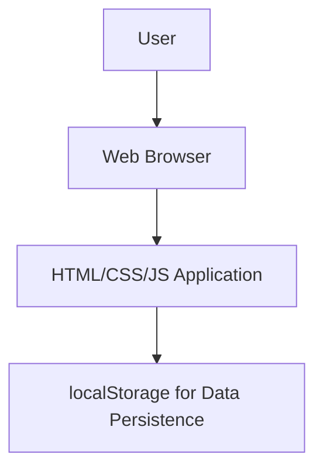

# Na We Pharmacy System - System Design

## System Architecture

The system is a client-side web application running entirely in the browser.

### Components
- **Frontend**: HTML pages with Tailwind CSS styling and JavaScript for interactivity and data management
- **Data Storage**: Browser localStorage for persistent data storage
- **No server required - runs entirely in browser**

## Data Structures

Data will be stored in browser localStorage as JSON objects. Key data structures:

- **Users**: Array of user objects with id, username, password (hashed), role, name, email
- **Patients**: Array of patient objects with id, name, dob, address, phone, email
- **Medications**: Array of medication objects with id, name, description, category, stock, expiration, supplier
- **Prescriptions**: Array of prescription objects with id, patientId, items (array of medication items), date, status
- **Suppliers**: Array of supplier objects with id, name, contact

## Key Design Decisions
- **Client-side Storage**: Using localStorage for simplicity and no server dependency
- **Role-based Access**: Simple role checking in JavaScript
- **Data Validation**: Client-side validation for forms
- **Modular Code**: Separate JavaScript files for different functionalities

## Security Considerations
- Password hashing using JavaScript crypto API
- Simple session management with localStorage
- Input sanitization to prevent XSS
- Basic role-based UI rendering

## User Interface Design
- Responsive design using Tailwind CSS
- Single-page application with navigation
- Forms for data entry with validation
- Tables for displaying data with search/filter capabilities